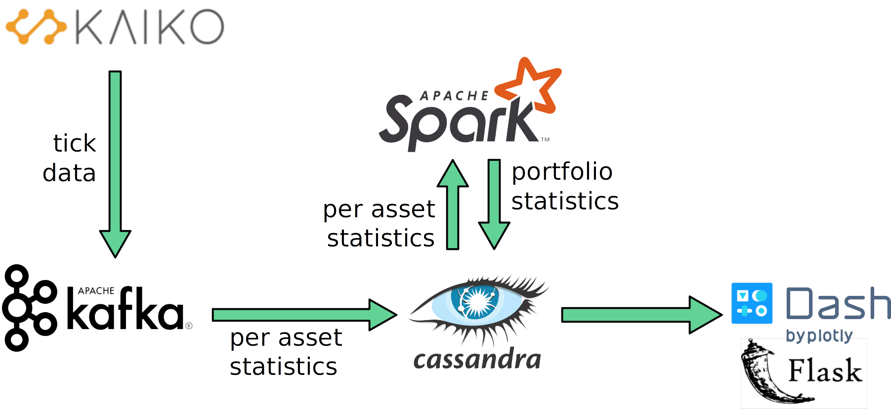

# SilverBullet
Take your best shot at crypto markets!

SilverBullet live optimization of cryptocurrency portfolio with very low latency, suited to high-frequency trading applications.

## Problem statement
Split second decisions can mean the difference between profit and ruin in modern markets. To fully exploit the economic potential of the market, a trading system must be able to evaluate market conditions with extremely high latency. If it takes too long to reach a decision, the situation will have changed and even a great decision will lose its value. I wanted to create an architecture that enables such low latency for live analysis of financial price data.

## General solution
Live tick data is read from a financial data provider (currently simulated with a Kafka producer) and ingested with Kafka. A Kafka consumer calculates per-asset summary statistics over a moving time window. Heavy computations, such as the Monte Carlo optimizer, run on Spark and can be readily scaled. Computation results are stored in Cassandra, and provided to the user with Dash (visualizations) and Flask (REST API).

## Setup
* Set up Kafka as described in [kafka-setup](setup/kafka/kafka-setup.md)
	* Kafka is a distributed, fault tolerant message queue. Kafka will ingest the price data into a message queue and make it available to other programs.
* Set up Spark as described in [spark-setup](setup/spark/spark-setup.md)
	* Apache Spark is a distributed processing framework. Spark will do the distributed computations.
	* Ensure that `exchange_simulator.py`, `asset_digest.py` and `portfolio_evaluate_spark.py` exist on the Spark master along with their dependencies (`exchange_simulator.py` requires the tick data to be present as well). Fill in the correct IPs and other details in .conf files. Run `exchange_simulator.py` and `asset_digest.py` directly, and `portfolio_evaluate_spark.py` with `spark-submit`.
* Set up Cassandra as described in [cassandra-setup](setup/cassandra/cassandra-setup.md)
	* Cassandra is a distributed database. It will store computation results.
* Set up a Web UI node as described in [webui-setup](setup/webui/webui-setup.md)

The Web UI should now be available on the Web UI node.

