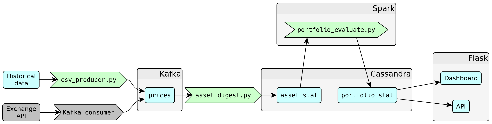

# Schema

This project utilizes the following datasets:

* `price` - tick or high-resolution time series data about each individual stock's price.
* `asset_stat` - summary statistics (risk and reward) of each asset.
* `portfolio` - portfolio candidates that will be considered.
* `portfolio_stat` - summary statistics (risk and reward) of each portfolio candidate.

All are continuously updated.

## Data flow



`price` is maintained under Kafka topic `price`, and is populated by separate Kafka producer scripts. These scripts read from an exchange's API (if live data) or a local file (if simulating with historical data) and push each price to Kafka.

All other data is stored in Redis. A Spark jobs read the latest prices in a moving window from Kafka, calculate `asset_stat` for each individual asset, generate `portfolio` and digest each one to get `portfolio_stat`. Flask reads from `portfolio_stat` to provide a live output of best portfolio risk/rewards.

## Schemata

### `price`

```
| asset | prices            |
| ----- | ----------------- |
| abc   | [p1, p2, p3, ...] |
| def   | [p4, p5, p6, ...] |
| ghi   | [p7, p8, p9, ...] |
| ...   | ...               |
```

`price` is stored as a Kafka topic. Internally, each price tick is a JSON dictionary that also stores asset name and timestamp. In a production environment, prices are pulled from an exchange API which is usually a paid service; therefore these prices are *de facto* "valuable". Because of this, Kafka is chosen for additional fault tolerance.

### `asset_stat`

```
| asset | reward | risk |
| ----- | ------ | ---- |
| abc   | g1     | s1   |
| def   | g2     | s2   |
| ghi   | g3     | s3   |
| ...   | ...    | ...  |
```

`asset_stat` is actually stored as two separate Redis hashmaps: `risk` and `reward`, both keyed by asset name with real numbers as value. This method is chosen because Redis does not allow nested dictionaries.

### `portfolio`

```
| portfolio | weights           |
| --------- | ----------------- |
| 123       | [w1, w2, w3, ...] |
| 456       | [w4, w5, w6, ...] |
| 789       | [w7, w8, w9, ...] |
| ...       | ...               |
```

`portfolio` maps portfolio ID's to vectors of real numbers representing the weights of each asset.

### `portfolio_stat`

```
| portfolio | reward | risk |
| --------- | ------ | ---- |
| 123       | g4     | s4   |
| 456       | g5     | s5   |
| 789       | g6     | s6   |
| ...       | ...    | ...  |
```

`portfolio_stat` is a table of total risk/reward for each portfolio.


